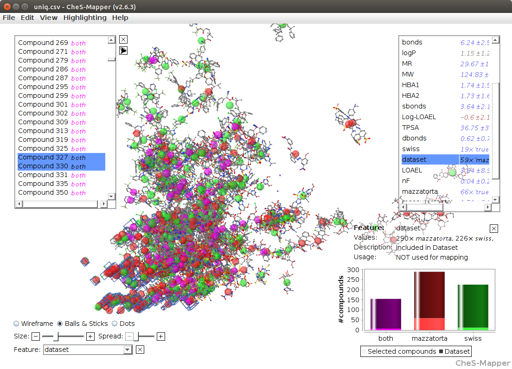

---
author: |
    Christoph Helma^1^, David Vorgrimmler^1^, Denis Gebele^1^, Martin Gütlein^2^, Benoit Schilter^3^, Elena Lo Piparo^3^
title: |
    Modeling Chronic Toxicity: A comparison of experimental variability with read across predictions
include-before: ^1^ in silico toxicology gmbh,  Basel, Switzerland\newline^2^ Inst. f. Computer Science, Johannes Gutenberg Universität Mainz, Germany\newline^3^ Chemical Food Safety Group, Nestlé Research Center, Lausanne, Switzerland
keywords: (Q)SAR, read-across, LOAEL
date: \today
abstract: " "
documentclass: achemso
bibliography: references.bibtex
bibliographystyle: achemso
figPrefix: Figure
eqnPrefix: Equation
tblPrefix: Table
output:
  pdf_document:
    fig_caption: yes
...

```{r echo=F}
rsquare <- function(x,y) { cor(x,y,use='complete')^2 }
rmse <-  function(x,y) { sqrt(mean((x-y)^2,na.rm=TRUE)) }
```

Introduction
============

Elena + Benoit

The quality and reproducibility of (Q)SAR and  read-across predictions is a controversial topic in the toxicological risk-assessment community. Although model predictions can be validated with various procedures it is rarely possible to put the results into the context of experimental variability, because replicate experiments are rarely available.

With missing information about the variability of experimental toxicity data it is hard to judge the performance of predictive models and it is tempting for model developments to use aggressive model optimisation methods that lead to impressive validation results, but also to overfitted models with little practical relevance.

In this study we intent to compare model predictions with experimental variability with chronic oral rat lowest adverse effect levels (LOAEL) as toxicity endpoint.
We are using two datasets, one from [@mazzatorta08] (*Mazzatorta* dataset) and one from the Swiss Federal Office of TODO (*Swiss Federal Office* dataset).

Elena: do you have a reference and the name of the department?

```{r echo=F}
m = read.csv("data/mazzatorta.csv",header=T)
s = read.csv("data/swiss.csv",header=T)
t = read.csv("data/test.csv",header=T)
c = read.csv("data/training.csv",header=T)
```

`r length(unique(t$SMILES))` compounds are common in both datasets and we use them as a test set in our investigation. For this test set we will

- compare the structural diversity of both datasets
- compare the LOAEL values in both datasets
- build prediction models based on the Mazzatorta, Swiss Federal Office datasets and a combination of both
- predict LOAELs of the training set
- compare predictions with experimental variability

With this investigation we also want to support the idea of reproducible research, by providing all datasets and programs that have been used to generate this manuscript under a TODO license.

A self-contained docker image with all program dependencies required for the reproduction of these results is available from TODO.

Source code and datasets for the reproduction of this manuscript can be downloaded from the GitHub repository TODO. The lazar framework [@Maunz2013] is also available under a GPL License from https://github.com/opentox/lazar.

TODO: github tags

Elena: please check if this is publication strategy is ok for the Swiss Federal Office

Materials and Methods
=====================

Datasets
--------

### Mazzatorta dataset

The first dataset (*Mazzatorta* dataset for further reference) originates from
the publication of [@mazzatorta08]. It contains chronic (> 180 days) lowest
observed effect levels (LOAEL) for rats (*Rattus norvegicus*) after oral
(gavage, diet, drinking water) administration.  The Mazzatorta dataset consists
of `r length(m$SMILES)` LOAEL values for `r length(unique(m$SMILES))` unique
chemical structures.

### Swiss Federal Office dataset

Elena + Swiss Federal Office contribution (input)

The original Swiss Federal Office dataset has chronic toxicity data for rats,
mice and multi generation effects. For the purpose of this study only rat LOAEL
data was used. This leads to the *Swiss Federal Office*  dataset with `r length(s$SMILES)` rat LOAEL
values for `r length(unique(s$SMILES))` unique chemical structures.

### Preprocessing

Chemical structures (represented as SMILES [@doi:10.1021/ci00057a005]) in both
datasets were checked for correctness, syntactically incorrect and missing
SMILES were generated from other identifiers (e.g names, CAS numbers). Unique
smiles from the OpenBabel library [@OBoyle2011] were used for the
identification of duplicated structures. 

Studies with undefined or empty LOAEL entries were removed from the datasets.
LOAEL values were converted to mmol/kg_bw/day units and rounded to five
significant digits. For prediction, validation and visualisation purposes
-log10 transformations are used.

### Derived datasets

Two derived datasets were obtained from the original datasets: 

The *test* dataset contains data of compounds that occur in both datasets.
LOAEL values equal at five significant digits were considered as duplicates
originating from the same study/publication and only one instance was kept in
the test dataset.  Exact duplications of LOAEL values were removed, because it
is very likely that they originate from the same study.  The test dataset has
`r length(t$SMILES)` LOAEL values for `r length(unique(t$SMILES))` unique
chemical structures.

The *training* dataset is the union of the Mazzatorta and the Swiss Federal
Office dataset and it is used to build predictive models. LOAEL duplicates were
removed, as for the test dataset.  The training dataset has `r
length(c$SMILES)` LOAEL values for `r length(unique(c$SMILES))` unique chemical
structures.

Algorithms
----------

In this study we are using the modular lazar (*la*zy *s*tructure
*a*ctivity *r*elationships) framework [@Maunz2013] for model
development and validation.

lazar follows the following basic workflow: For a given chemical
structure lazar 

- searches in a database for similar structures (*neighbors*)
with experimental data, 
- builds a local QSAR model with these neighbors
and 
- uses this model to predict the unknown activity of the query
compound.

This procedure resembles an automated version of *read across*
predictions in toxicology, in machine learning terms it would be
classified as a *k-nearest-neighbor* algorithm.

Apart from this basic workflow lazar is completely modular and allows
the researcher to use any algorithm for similarity searches and
local QSAR modelling. Within this study we are using the following
algorithms:

### Neighbor identification

Similarity calculations are based on MolPrint2D fingerprints
[@doi:10.1021/ci034207y] from the OpenBabel chemoinformatics library
[@OBoyle2011].

The MolPrint2D fingerprint uses atom environments as molecular representation,
which resemble basically the chemical concept of functional groups. For each
atom in a molecule it represents the chemical environment using the atom types
of connected atoms.

MolPrint2D fingerprints are generated dynamically from chemical structures and
do not rely on predefined lists of fragments (such as OpenBabel FP3, FP4 or
MACCs fingerprints or lists of toxocophores/toxicophobes). This has the
advantage the they may capture substructures of toxicological relevance that
are not included in other fingerprints.  Preliminary experiments have shown
that predictions with MolPrint2D fingerprints are indeed more accurate than
other OpenBabel fingerprints.

From MolPrint2D fingerprints we can construct a feature vector with all atom
environments of a compound, which can be used to calculate chemical
similarities.

[//]: # https://openbabel.org/docs/dev/FileFormats/MolPrint2D_format.html#molprint2d-format

The chemical similarity between two compounds A and B is expressed as the
proportion between atom environments common in both structures $A \cap B$ and the
total number of atom environments $A \cup B$ (Jaccard/Tanimoto index, [@eq:jaccard]).

$$ sim = \frac{|A \cap B|}{|A \cup B|} $$ {#eq:jaccard}

A threshold of $sim < 0.1$ is used for the identification of neighbors for
local QSAR models.  Compounds with the same structure as the query structure
are eliminated from the neighbors to obtain an unbiased prediction.

### Local QSAR models and predictions

Only similar compounds (*neighbors*) are used for local QSAR models.  In this
investigation we are using a weighted partial least squares regression (PLS)
algorithm for the prediction of quantitative properties.  First all fingerprint
features with identical values across all neighbors are removed.  The reamining
set of features is used as descriptors for creating a local weighted PLS model
with atom environments as descriptors and model similarities as weights. The
`pls` method from the `caret` R package [@Kuhn08] is used for this purpose.

Finally the local PLS model is applied to predict the activity of the query
compound.

If PLS modelling or prediction fails, the program resorts to using the weighted
mean of the neighbors LOAEL values, where the contribution of each neighbor is
weighted by its similarity to the query compound.

default settings for tuning

### Applicability domain

Christoph: TODO

Prediction intervals were obtained from the `predict` function.

### Validation

For the comparison of experimental variability with predictive accuracies we
are using a test set of compounds that occur in both datasets. The
*Mazzatorta*, *Swiss Federal Office* and *training* datasets are used as
training data for read across predictions. In order to obtain unbiased
predictions *all* information from the test compound is removed from the
training set prior to predictions. This procedure is hardcoded into the
prediction algorithm in order to prevent validation errors.  Traditional
10-fold crossvalidation results are provided as additional information for all
three models. 

TODO: treatment of duplicates

Christoph: check if these specifications have changed at submission

Results
=======

### Dataset comparison

Elena

The main objective of this section is to compare the content of both
databases in terms of structural composition and LOAEL values, to
estimate the experimental variability of LOAEL values and to establish a
baseline for evaluating prediction performance.


##### Ches-Mapper analysis

We applied the visualization tool CheS-Mapper (Chemical Space Mapping and Visualization in 3D,
http://ches-mapper.org, @Gütlein2012) to compare both datasets. CheS-Mapper can be used to analyze the relationship between the structure of chemical compounds, their physico-chemical properties, and biological or toxic effects. It embeds a dataset into 3D space, such that compounds with similar feature values are close to each other. CheS-Mapper is generic and can be employed with different kinds of features. [@fig:ches-mapper-pc] shows an embedding that is based on physico-chemical (PC) descriptors.

{#fig:ches-mapper-pc}

Martin: explain  light colors at bottom of histograms

In this example, CheS-Mapper applied a principal components analysis to map compounds according to their physico-chemical (PC) feature values into 3D space. Both datasets have in general very similar PC feature values. As an exception, the Mazzatorta dataset includes most of the tiny compound structures: we have selected the 78 smallest compounds (with 10 atoms and less, marked with a blue box in the screen-shot) and found that 61 of these compounds occur in the Mazzatorta dataset, whereas only 19 are contained in the Swiss dataset (p-value 3.7E-7).

This result was confirmed for structural features (fingerprints) including MolPrint2D features that are utilized for model building in this work.

In general we concluded that both datasets are very similar, in terms of chemical structures and physico-chemical properties. 

##### Distribution of functional groups

```{r echo=F}
fg = read.csv('data/functional-groups.csv',head=F)
```

In order to confirm the results of CheS-Mapper analysis we have evaluated the
frequency of functional groups from the OpenBabel FP4
fingerprint. [@fig:fg] shows the frequency of functional groups 
in
both datasets. `r length(fg$V1)` functional groups with a frequency > 25 are depicted, the complete table for all functional groups can be found in the
data directory of the supplemental material (`data/functional-groups.csv`).
 
{#fig:fg}

### Experimental variability versus prediction uncertainty 

Duplicated LOAEL values can be found in both datasets and there is a
substantial number of `r length(unique(t$SMILES))` compounds occurring in both
datasets.  These duplicates allow us to estimate the variability of
experimental results within individual datasets and between datasets.

##### Intra dataset variability

```{r echo=F}
m.dupsmi = unique(m$SMILES[duplicated(m$SMILES)])
s.dupsmi = unique(s$SMILES[duplicated(s$SMILES)])

m.dup = m[m$SMILES %in% m.dupsmi,]
s.dup = s[s$SMILES %in% s.dupsmi,]

m.dupnr = length(m.dupsmi)
s.dupnr = length(s.dupsmi)

m.dup$var = ave(-log10(m.dup$LOAEL),m.dup$SMILES,FUN=var)
s.dup$var = ave(-log10(s.dup$LOAEL),s.dup$SMILES,FUN=var)

p = t.test(m.dup$var,s.dup$var)$p.value
```

The Mazzatorta dataset has `r length(m$SMILES)` LOAEL values for `r length(levels(m$SMILES))` unique structures, `r m.dupnr` compounds have multiple measurements with an average variance of `r round(mean(m.dup$var,na.rm=T),2)` log10 units [@fig:intra]. 

The Swiss Federal Office dataset has `r length(s$SMILES)` rat LOAEL values for `r length(levels(s$SMILES))` unique structures, `r s.dupnr` compounds have multiple measurements with a similar variance (average `r round(mean(s.dup$var),2)` log10 units). Variances of both datasets do not show a statistically significant difference with a
p-value (t-test) of `r round(p,2)`.

{#fig:intra}

##### Inter dataset variability

[@fig:comp] shows the experimental LOAEL variability of compounds occurring in both datasets (i.e. the *test* dataset) colored in red (experimental). This is the baseline reference for the comparison with predicted values.

##### LOAEL correlation between datasets

```{r echo=F}
data <- read.csv("data/median-correlation.csv",header=T)
cor <- cor.test(-log(data$mazzatorta),-log(data$swiss))
median.p <- cor$p.value
median.r.square <- round(rsquare(-log(data$mazzatorta),-log(data$swiss)),2)
median.rmse <- round(rmse(-log(data$mazzatorta),-log(data$swiss)),2)
``` 

[@fig:corr] depicts the correlation between LOAEL values from both datasets. As both datasets contain duplicates we are using medians for the correlation plot and statistics. Please note that the aggregation of duplicated measurements into a single value hides a substantial portion of the real experimental variability.
Correlation analysis shows a
significant (p-value < 2.2e-16) correlation between the experimental data in both datasets with r\^2: `r round(median.r.square,2)`, RMSE: `r round(median.rmse,2)`

### Local QSAR models

In order to compare the perfomance of in silico models with experimental variability we are using compounds that occur in both datasets as a test set (`r  length(t$SMILES)` measurements, `r  length(unique(t$SMILES))` compounds).

The Mazzatorta, the Swiss Federal Office dataset and a combined dataset were used as training data for building `lazar` read across models. Predictions for the test set compounds were made after eliminating all information from the test compound from the corresponding training dataset. [@fig:comp] summarizes the results:

{#fig:comp}

```{r echo=F}
training = read.csv("data/training-test-predictions.csv",header=T)
training.r_square = round(rsquare(-log(training$LOAEL_measured_median),-log(training$LOAEL_predicted)),2)
training.rmse = round(rmse(-log(training$LOAEL_measured_median),-log(training$LOAEL_predicted)),2)
```

TODO: nr unpredicted, nr predictions outside of experimental values

Correlation analysis has been perfomed between individual predictions and the median of exprimental data.
All correlations are statistically highly significant with a p-value < 2.2e-16.
These results are presented in [@fig:corr] and [@tbl:cv]. Please bear in mind that the aggregation of experimental data into a single value actually hides experimental variability.

Training data | $r^2$                     | RMSE                    
--------------|---------------------------|-------------------------
Experimental | `r median.r.square`      | `r median.rmse`           
Combined             | `r training.r_square` | `r training.rmse` 

: Comparison of model predictions with experimental variability. {#tbl:common-pred}

{#fig:corr}

```{r echo=F}
t0 = read.csv("data/training-cv-0.csv",header=T)
cv.t0.r_square = round(rsquare(-log(t0$LOAEL_measured_median),-log(t0$LOAEL_predicted)),2)
cv.t0.rmse = round(rmse(-log(t0$LOAEL_measured_median),-log(t0$LOAEL_predicted)),2)
t1 = read.csv("data/training-cv-1.csv",header=T)
cv.t1.r_square = round(rsquare(-log(t1$LOAEL_measured_median),-log(t1$LOAEL_predicted)),2)
cv.t1.rmse = round(rmse(-log(t1$LOAEL_measured_median),-log(t1$LOAEL_predicted)),2)
t2 = read.csv("data/training-cv-2.csv",header=T)
cv.t2.r_square = round(rsquare(-log(t2$LOAEL_measured_median),-log(t2$LOAEL_predicted)),2)
cv.t2.rmse = round(rmse(-log(t2$LOAEL_measured_median),-log(t2$LOAEL_predicted)),2)
```
TODO: repeated CV

Traditional 10-fold cross-validation results are summarised in [@tbl:cv] and [@fig:cv].
All correlations are statistically highly significant with a p-value < 2.2e-16.

Training dataset | $r^2$ | RMSE 
-----------------|-------|------
Combined | `r round(cv.t0.r_square,2)`  | `r round(cv.t0.rmse,2)` 
Combined | `r round(cv.t1.r_square,2)`  | `r round(cv.t1.rmse,2)` 
Combined | `r round(cv.t2.r_square,2)`  | `r round(cv.t2.rmse,2)` 

: 10-fold crossvalidation results {#tbl:cv}


{#fig:cv}


Discussion
==========

Elena + Benoit

- both datasets are structurally similar
- LOAEL values have similar variability in both datasets
- the Mazzatorta dataset has a small portion of very toxic compounds (low LOAEL, high -log10(LOAEL))
- lazar read across predictions fall within the experimental variability of LOAEL values
- predictions are slightly less accurate at extreme (high/low) LOAEL values, this can be explained by the algorithms used
- the original Mazzatorta paper has "better" results (R^2 0.54, RMSE 0.7) , but the model is likely to be overfitted (using genetic algorithms for feature selection *prior* to crossvalidation must lead to overfitted models)
- beware of over-optimisations and the race for "better" validation results

Summary
=======

References
==========
