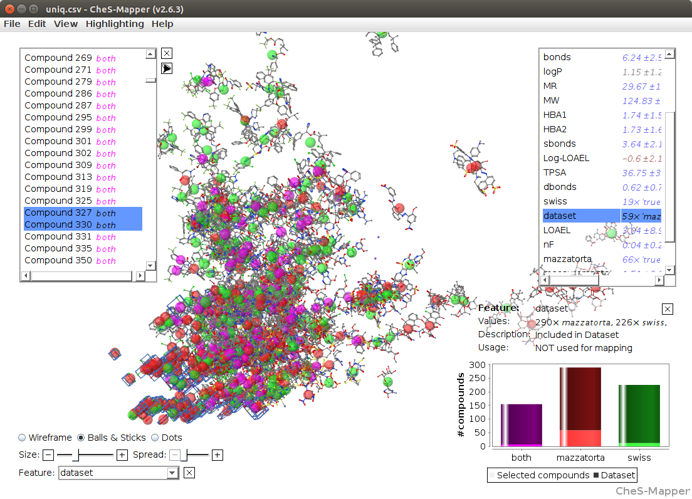

---
author: |
    Christoph Helma^1^, David Vorgrimmler^1^, Denis Gebele^1^, Martin G<c3><bc>tlein^2^, Benoit Schilter^3^, Elena Lo Piparo^3^
title: |
    Modeling Chronic Toxicity: A comparison of experimental variability with read across predictions
include-before: ^1^ in silico toxicology gmbh,  Basel, Switzerland\newline^2^ Inst. f. Computer Science, Johannes Gutenberg Universit<c3><a4>t Mainz, Germany\newline^3^ Chemical Food Safety Group, Nestl<c3><a9> Research Center, Lausanne, Switzerland
keywords: (Q)SAR, read-across, LOAEL
date: \today
abstract: " "
documentclass: achemso
bibliography: references.bibtex
bibliographystyle: achemso
figPrefix: Figure
eqnPrefix: Equation
tblPrefix: Table
output:
  pdf_document:
    fig_caption: yes
header-includes:
  - \usepackage{lineno}
  - \linenumbers
...


Introduction
============

Elena + Benoit

The quality and reproducibility of (Q)SAR and  read-across predictions is a
controversial topic in the toxicological risk-assessment community. Although
model predictions can be validated with various procedures it is rarely
possible to put the results into the context of experimental variability,
because replicate experiments are rarely available.

With missing information about the variability of experimental toxicity data it
is hard to judge the performance of predictive models and it is tempting for
model developments to use aggressive model optimisation methods that lead to
impressive validation results, but also to overfitted models with little
practical relevance.

In this study we intent to compare model predictions with experimental
variability with chronic oral rat lowest adverse effect levels (LOAEL) as
toxicity endpoint.  We are using two datasets, one from [@mazzatorta08]
(*Mazzatorta* dataset) and one from the Swiss Federal Office of TODO (*Swiss
Federal Office* dataset).

Elena: do you have a reference and the name of the department?


155 compounds are common in both datasets and we use
them as a *test* set in our investigation. For the Mazzatorta and Swiss Federal Office datasets we will

- compare the structural diversity of both datasets
- compare the LOAEL values in both datasets
- build prediction models 
- predict LOAELs of the training set
- compare predictions with experimental variability

With this investigation we also want to support the idea of reproducible
research, by providing all datasets and programs that have been used to
generate this manuscript under TODO creative/scientific commons? (datasets) and
GPL (programs) licenses.

A self-contained docker image with all program dependencies required for the
reproduction of these results is available from TODO.

Source code and datasets for the reproduction of this manuscript can be
downloaded from the GitHub repository TODO. The lazar framework [@Maunz2013] is
also available under a GPL License from https://github.com/opentox/lazar.

Elena: please check if this is publication strategy is ok for the Swiss Federal Office

Materials and Methods
=====================

Datasets
--------

### Mazzatorta dataset

The first dataset (*Mazzatorta* dataset for further reference) originates from
the publication of [@mazzatorta08]. It contains chronic (> 180 days) lowest
observed effect levels (LOAEL) for rats (*Rattus norvegicus*) after oral
(gavage, diet, drinking water) administration.  The Mazzatorta dataset consists
of 567 LOAEL values for 445 unique
chemical structures.

### Swiss Federal Office dataset

Elena + Swiss Federal Office contribution (input)

The original Swiss Federal Office dataset has chronic toxicity data for rats,
mice and multi generation effects. For the purpose of this study only rat LOAEL
data with oral administration was used. This leads to the *Swiss Federal
Office*  dataset with 493 rat LOAEL values for `r
length(unique(s$SMILES))` unique chemical structures.

### Preprocessing

Chemical structures (represented as SMILES [@doi:10.1021/ci00057a005]) in both
datasets were checked for correctness. Syntactically incorrect and missing
SMILES were generated from other identifiers (e.g names, CAS numbers). Unique
smiles from the OpenBabel library [@OBoyle2011] were used for the
identification of duplicated structures. 

Studies with undefined or empty LOAEL entries were removed from the datasets.
LOAEL values were converted to mmol/kg_bw/day units and rounded to five
significant digits. For prediction, validation and visualisation purposes
-log10 transformations are used.

### Derived datasets

Two derived datasets were obtained from the original datasets: 

The *test* dataset contains data of compounds that occur in both datasets.
LOAEL values equal at five significant digits were considered as duplicates
originating from the same study/publication and only one instance was kept in
the test dataset.  The test dataset has
375 LOAEL values for 155 unique
chemical structures.

The *training* dataset is the union of the Mazzatorta and the Swiss Federal
Office dataset and it is used to build predictive models. LOAEL duplicates were
removed using the same criteria as for the test dataset.  The training dataset
has 998 LOAEL values for 671 unique
chemical structures.

Algorithms
----------

In this study we are using the modular lazar (*la*zy *s*tructure *a*ctivity
*r*elationships) framework [@Maunz2013] for model development and validation.

lazar follows the following basic workflow: For a given chemical structure
lazar 

- searches in a database for similar structures (*neighbors*) with experimental
  data, 
- builds a local QSAR model with these neighbors and 
- uses this model to predict the unknown activity of the query compound.

This procedure resembles an automated version of *read across* predictions in
toxicology, in machine learning terms it would be classified as a
*k-nearest-neighbor* algorithm.

Apart from this basic workflow lazar is completely modular and allows the
researcher to use any algorithm for similarity searches and local QSAR
modelling. Within this study we are using the following algorithms:

### Neighbor identification

Similarity calculations are based on MolPrint2D fingerprints
[@doi:10.1021/ci034207y] from the OpenBabel chemoinformatics library
[@OBoyle2011].

The MolPrint2D fingerprint uses atom environments as molecular representation,
which resemble basically the chemical concept of functional groups. For each
atom in a molecule it represents the chemical environment using the atom types
of connected atoms.

MolPrint2D fingerprints are generated dynamically from chemical structures and
do not rely on predefined lists of fragments (such as OpenBabel FP3, FP4 or
MACCs fingerprints or lists of toxocophores/toxicophobes). This has the
advantage the they may capture substructures of toxicological relevance that
are not included in other fingerprints.  Preliminary experiments have shown
that predictions with MolPrint2D fingerprints are indeed more accurate than
other OpenBabel fingerprints.

From MolPrint2D fingerprints we can construct a feature vector with all atom
environments of a compound, which can be used to calculate chemical
similarities.

[//]: # https://openbabel.org/docs/dev/FileFormats/MolPrint2D_format.html#molprint2d-format

The chemical similarity between two compounds A and B is expressed as the
proportion between atom environments common in both structures $A \cap B$ and the
total number of atom environments $A \cup B$ (Jaccard/Tanimoto index, [@eq:jaccard]).

$$ sim = \frac{|A \cap B|}{|A \cup B|} $$ {#eq:jaccard}

A threshold of $sim > 0.1$ is used for the identification of neighbors for
local QSAR models.  Compounds with the same structure as the query structure
are eliminated from the neighbors to obtain  unbiased predictions in the presence of duplicates.

### Local QSAR models and predictions

Only similar compounds (*neighbors*) above the threshold are used for local
QSAR models.  In this investigation we are using a weighted partial least
squares regression (PLS) algorithm for the prediction of quantitative
properties.  First all fingerprint features with identical values across all
neighbors are removed.  The reamining set of features is used as descriptors
for creating a local weighted PLS model with atom environments as descriptors
and model similarities as weights. The `pls` method from the `caret` R package
[@Kuhn08] is used for this purpose.  Models are trained with the default
`caret` settings, optimizing the number of PLS components by bootstrap
resampling.

Finally the local PLS model is applied to predict the activity of the query
compound. The RMSE of bootstrapped model predictions is used to construct 95\%
prediction intervals at 1.96*RMSE.

If PLS modelling or prediction fails, the program resorts to using the weighted
mean of the neighbors LOAEL values, where the contribution of each neighbor is
weighted by its similarity to the query compound.

### Applicability domain

The applicability domain of lazar models is determined by the structural
diversity of the training data. If no similar compounds are found in the
training data no predictions will be generated. If the query compounds contains
substructures that are not covered by training examples a warning is issued.

Local regression models consider neighbor similarities to the query compound,
by weighting the contribution of each neighbor is weighted by its similarity
index. The variability of local model predictions is reflected in the
prediction interval.

### Validation

For the comparison of experimental variability with predictive accuracies we
are using a test set of compounds that occur in both datasets. Unbiased read
across predictions are obtained from the *training* dataset, by removing *all*
information from the test compound from the training set prior to predictions.
This procedure is hardcoded into the prediction algorithm in order to prevent
validation errors. As we have only a single test set no model or parameter
optimisations were performed in order to avoid overfitting a single dataset.

Results from 3 repeated 10-fold crossvalidations with independent training/test
set splits are provided as additional information to the test set results.

Results
=======

### Dataset comparison

The main objective of this section is to compare the content of both
databases in terms of structural composition and LOAEL values, to
estimate the experimental variability of LOAEL values and to establish a
baseline for evaluating prediction performance.

##### Ches-Mapper analysis

We applied the visualization tool CheS-Mapper (Chemical Space Mapping and
Visualization in 3D, http://ches-mapper.org, @G<U+FFFD><U+FFFD>tlein2012) to compare both
datasets. CheS-Mapper can be used to analyze the relationship between the
structure of chemical compounds, their physico-chemical properties, and
biological or toxic effects. It embeds a dataset into 3D space, such that
compounds with similar feature values are close to each other. CheS-Mapper is
generic and can be employed with different kinds of features.
[@fig:ches-mapper-pc] shows an embedding that is based on physico-chemical (PC)
descriptors.

{#fig:ches-mapper-pc}

Martin: please explain light colors at bottom of histograms

In this example, CheS-Mapper applied a principal components analysis to map
compounds according to their physico-chemical (PC) feature values into 3D
space. Both datasets have in general very similar PC feature values. As an
exception, the Mazzatorta dataset includes most of the tiny compound
structures: we have selected the 78 smallest compounds (with 10 atoms and less,
marked with a blue box in the screen-shot) and found that 61 of these compounds
occur in the Mazzatorta dataset, whereas only 19 are contained in the Swiss
dataset (p-value 3.7E-7).

This result was confirmed for structural features (fingerprints) including
MolPrint2D features that are utilized for model building in this work.

In general we concluded that both datasets are very similar, in terms of
chemical structures and physico-chemical properties. 

##### Distribution of functional groups


In order to confirm the results of CheS-Mapper analysis we have evaluated the
frequency of functional groups from the OpenBabel FP4 fingerprint. [@fig:fg]
shows the frequency of functional groups in both datasets. 139
functional groups with a frequency > 25 are depicted, the complete table for
all functional groups can be found in the data directory of the supplemental
material (`data/functional-groups.csv`).
 
{#fig:fg}

### Experimental variability versus prediction uncertainty 

Duplicated LOAEL values can be found in both datasets and there is a
substantial number of 155 compounds occurring in both
datasets.  These duplicates allow us to estimate the variability of
experimental results within individual datasets and between datasets.

##### Intra dataset variability


```
## Error in split.default(x, g): first argument must be a vector
```

The Mazzatorta dataset has 567 LOAEL values for
445 unique structures, 93
compounds have multiple measurements with a mean standard deviation of
0.32 log10 units (@mazzatorta08, [@fig:intra]). 

The Swiss Federal Office dataset has 493 rat LOAEL values for
381 unique structures, 91 compounds have
multiple measurements with a mean standard deviation of
0.29 log10 units.

Standard deviations of both datasets do not show
a statistically significant difference with a p-value (t-test) of 0.21.
The combined test set has a mean standard deviation of NA 
log10 units.

{#fig:intra}

##### Inter dataset variability

[@fig:comp] shows the experimental LOAEL variability of compounds occurring in both datasets (i.e. the *test* dataset) colored in red (experimental). This is the baseline reference for the comparison with predicted values.

##### LOAEL correlation between datasets


[@fig:corr] depicts the correlation between LOAEL values from both datasets. As
both datasets contain duplicates we are using medians for the correlation plot
and statistics. Please note that the aggregation of duplicated measurements
into a single median value hides a substantial portion of the experimental
variability.  Correlation analysis shows a significant (p-value < 2.2e-16)
correlation between the experimental data in both datasets with r\^2:
0.52, RMSE: 0.59

### Local QSAR models


In order to compare the performance of in silico read across models with experimental
variability we are using compounds that occur in both datasets as a test set
(375 measurements, 155 compounds).
`lazar` read across predictions
were obtained for 155 compounds, 29
predictions failed, because no similar compounds were found in the training data (i.e. they were not covered by the applicability domain of the training data).


Experimental data and 95\% prediction intervals did not overlap in 0 cases
(0\%),
0 predictions were too high and
0 predictions too low (after -log10 transformation).

[@fig:comp] shows a comparison of predicted with experimental values:

{#fig:comp}

Correlation analysis was performed between individual predictions and the
median of experimental data.  All correlations are statistically highly
significant with a p-value < 2.2e-16.  These results are presented in
[@fig:corr] and [@tbl:cv]. Please bear in mind that the aggregation of
experimental data into a single median value hides experimental variability.

Comparison    | $r^2$                     | RMSE                    
--------------|---------------------------|-------------------------
Mazzatorta vs. Swiss | 0.52      | 0.59           
Prediction vs. Test median             | 0.33 | 0.67 

: Comparison of model predictions with experimental variability. {#tbl:common-pred}

{#fig:corr}


For a further assessment of model performance three independent 
10-fold cross-validations were performed. Results are summarised in [@tbl:cv] and [@fig:cv].
All correlations of predicted with experimental values are statistically highly significant with a p-value < 2.2e-16.

 $r^2$ | RMSE | Nr. predicted
-------|------|----------------
0.38  | 0.8 | 609/671
0.35  | 0.82 | 611/671
0.37  | 0.81 | 610/671

: Results from 3 independent 10-fold crossvalidations {#tbl:cv}

{#fig:cv}

Discussion
==========

Elena + Benoit

### Dataset comparison

Our investigations clearly indicate that the Mazzatorta and Swiss Federal Office datasets are very similar in terms of chemical structures and properties and the distribution of experimental LOAEL values. The only minor difference that we have observed is that the Mazzatorta dataset has a larger number of highly toxic compounds [@fig:intra] and a larger amount of small molecules, than the Swiss Federal Office dataset. For this reason we have pooled both dataset into a single training dataset for read across predictions.

[@fig:intra] and [@fig:corr] and [@tbl:common-pred] show however considerable variability in the experimental data. 
High experimental variability 
has an impact on model building and on model validation.
First it influences model quality by introducing noise into the training data, secondly it influences accuracy estimates because predictions have to be compared against noisy data where "true" experimental values are unknown.
This will become obvious in the next section, where we compare predictions with experimental data.

### Local QSAR models

[@fig:comp], [@fig:corr], [@tbl:common-pred]
and the fact that experimental data is covered in
100\% by the `lazar`
prediction interval shows that `lazar` read across predictions fit well into
the experimental variability of LOAEL values.

It is tempting to increase the "quality" of predictions by performing parameter or algorithm optimisations, but this may lead to overfitted models, because the training set is known beforehand.
As prediction accuracies correspond well to experimental accuracies, and the visual inspection of predictions does not show obvious anomalies, we consider our model as a robust method for LOAEL estimations.
Prediction accuracies that are lower than experimental variability would be a clear sign for a model that is overfitted for a particular test set.

The graphical interface provides intuitive means of inspecting the rationales and data used for read across predictions. In order to show how such an inspection can help to identify problematic predictions
we present a brief analysis of the two most severe mispredictions:


The compound with the largest deviation of prediction intervals is (amino-methylsulfanyl-phosphoryl)oxymethane (SMILES COP(=O)(SC)N) with an experimental median of 2.67 and a prediction interval of 0.43 +/- 0.35. In this case the prediction is based on two neighbors with very low similarity (0.1 and 0.13). Such cases can be eliminated by raising the similarity threshold for neighbors, but that could come at the cost of a larger number of unpredicted compounds. The graphical user interface shows for each prediction neighbors and similarities for a critical examination which should make the detection of similar cases rather straightforward.


The compound with second largest deviation of prediction intervals is
Endosulfan (SMILES O=S1OCC2C(CO1)C1(C(C2(Cl)C(=C1Cl)Cl)(Cl)Cl)Cl)
with an experimental median of 1.74 and a prediction interval of 3.44 +/- 1.7. In this case the prediction is based on 5 neighbors with similarities between 0.33 and 0.4. All of them are polychlorinated compound, but none of them contains sulfur or is a sulfurous acid ester. Again such problems are easily identified from a visual inspection of neighbors, and we want to stress the importance of inspecting rationales for predictions in the graphical interface before accepting a prediction.

Summary
=======

- beware of over-optimisations and the race for "better" validation results
- reproducible research

References
==========
