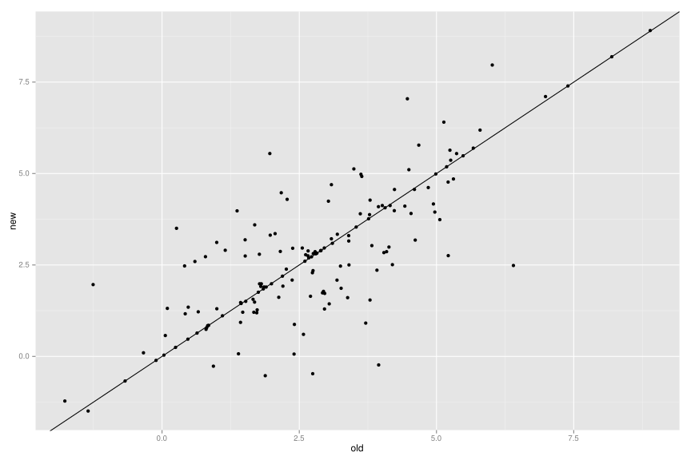

Introduction
------------

Data
----

LOAEL Values
............

Comparison of variances in datasets
~~~~~~~~~~~~~~~~~~~~~~~~~~~~~~~~~~~

p-value: 0.4750771581019402

.. image:: loael-variance.svg

Comparison of compounds in both datasets
~~~~~~~~~~~~~~~~~~~~~~~~~~~~~~~~~~~~~~~~

.. image:: loael-dataset-comparison-mmol_kg_day.svg

Correlation between datasets
~~~~~~~~~~~~~~~~~~~~~~~~~~~~

using means

with "identical" values

  r^2: 0.6106457754533314
  RMSE: 1.2228212261024438
  MAE: 0.801626064534318
